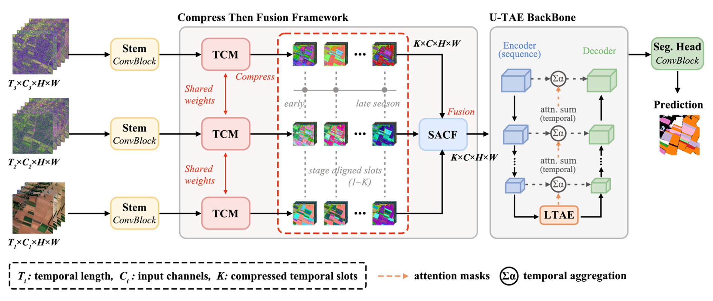

<div align="center">

# Compress-Then-Fuse

### A Scalable Framework for Crop Mapping From<br>Asynchronous Multimodal Satellite Time Series

<!-- TODO (after acceptance): point the Paper badge to the DOI and the Dataset badge to the download page. -->
[](#citation)
[](#sen4agrinet-mm)
[](https://www.python.org/)
[](https://pytorch.org/)

*Fusing asynchronous Sentinel-1 and Sentinel-2 time series without temporal resampling,<br>without a reference sensor, and with a single backbone.*

[Overview](#overview) · [Results](#main-results) · [Installation](#installation) · [Datasets](#datasets) · [Usage](#running-experiments) · [Citation](#citation)

</div>

> [!NOTE]
> This repository accompanies a manuscript that is currently under review. The **Sen4AgriNet-MM** download link and the **citation** will be added upon acceptance.

## Overview

Sentinel-1 SAR and Sentinel-2 optical time series complement each other for crop mapping, but they are acquired on different calendars, and clouds make the optical series irregular. **Compress-Then-Fuse (CTF)** combines these streams without forcing all sensors onto the same acquisition dates: a **temporal compression module (TCM)** summarizes each stream into a few ordered stages, and **stage-aligned cross-modal fusion (SACF)** merges the streams stage by stage before a single, shared U-TAE segmentation backbone.

<p align="center"></p>

| Step | Module | What it does | Code |
|:--|:--|:--|:--|
| **1.&nbsp;Compress** | TCM | After a stream-specific stem, maps each stream's irregular acquisition sequence to a fixed number *K* of ordered stage features (*K* = 4 by default) while retaining the temporal variation within each stage. TCM parameters are shared across streams. | [`models/tcm.py`](models/tcm.py) |
| **2.&nbsp;Fuse** | SACF | Combines corresponding stages across streams using attention, mean, and disagreement features. No S2-centered query stream is required. | [`models/sacf.py`](models/sacf.py) |
| **3.&nbsp;Segment** | U-TAE | A shared U-TAE encoder/decoder predicts a crop class for each pixel. | [`models/network.py`](models/network.py) |

This repository provides the TCM and SACF implementations, a U-TAE-based segmentation model, baseline fusion strategies, and an experiment registry for single-modality, multimodal, and early-season settings.

## Highlights

- Asynchronous SAR and optical series are compressed to shared stages, not resampled.
- Four stages instead of acquisition series raised mIoU and cut FLOPs by up to 91%.
- Stage-aligned cross-modal fusion led in early-season and cross-year tests.
- Temporal compression helped most when models were applied to new regions or years.
- Sen4AgriNet is extended with Sentinel-1 series for cross-region multimodal tests.

## Main Results

Results reported in the paper on Extended PASTIS-R (full season, official five-fold protocol, U-TAE backbone). All models were retrained under identical settings.

| Method | Enc. | mIoU (%)<br>w/o TCM | mIoU (%)<br>with TCM | Params (k)<br>with TCM | GFLOPs<br>w/o → with TCM |
|:--|:--:|:--:|:--:|:--:|:--:|
| ***Single modality*** | | | | | |
| S2-only | 1 | 64.9 | 66.8 | 1,108 | 122.5 → 67.5 |
| S1A-only | 1 | 54.8 | 56.2 | 1,104 | 174.1 → 88.4 |
| S1D-only | 1 | 55.9 | 57.3 | 1,104 | 174.1 → 88.4 |
| ***Multimodal fusion (S2 + S1A + S1D)*** | | | | | |
| Early (interpolate-then-compress) | 1 | 66.2 | 67.4 | 1,112 | 127.0 → 72.1 |
| Late | 3 | 67.6 | 68.5 | 3,292 | 470.5 → 242.8 |
| Decision | 3 | 67.1 | 68.2 | 3,274 | 471.4 → 243.7 |
| Cross-Attn S2-Center | 1 | 66.9 | 68.4 | 1,237 | 369.5 → 232.1 |
| Early (compress-then-concat) † | 1 | — | 68.6 | 1,199 | 227.1 |
| Cross-Attn N×N † | 1 | — | 68.7 | 1,254 | 237.7 |
| **SACF † (CTF, ours)** | **1** | — | **68.8** | 1,240 | 233.5 |

<sub>† Requires the stage-aligned sequences produced by TCM. Enc. = number of backbone encoders. GFLOPs are computed for an S2 input of shape (1, 40, 10, 128, 128) and S1A/S1D inputs of shape (1, 60, 3, 128, 128).</sub>

With the coherence channels appended to the same-orbit SAR streams (the `hybrid` input; see experiment `115`), SACF reaches **69.3%** mIoU. Experiments `4` and `49` run the S2-only model with TCM and the full CTF model, respectively.

## Installation

Our environment used Python 3.12 and PyTorch 2.8.0 built for CUDA 12.8.

```bash
# (Optional) create a fresh environment
conda create -n ctf python=3.12 -y
conda activate ctf

# On a CUDA 12.8 system: install the PyTorch build used in our environment first
python -m pip install torch==2.8.0 --index-url https://download.pytorch.org/whl/cu128

# Install the project's direct Python dependencies
python -m pip install -r requirements.txt
```

Other operating systems and GPU/CPU configurations may require a different PyTorch build (see the [PyTorch installation guide](https://pytorch.org/get-started/locally/)). `requirements.txt` lists only direct dependencies; it does not include Conda's local build paths or packages that belong only to the notebook environment.

## Datasets

The paper evaluates CTF on three datasets:

| Dataset | Region<br>Year(s) | Streams (channels) | Role in the paper |
|:--|:--|:--|:--|
| Extended<br>PASTIS-R | France<br>2019 | S2 (10), S1A (3), S1D (3), S1A/S1D coherence (2 each) | In-domain benchmark and ablations |
| **Sen4AgriNet&#8209;MM**<br>(ours) | Catalonia (Spain), France<br>2019 | S2 (10), S1A (2), S1D (2) | Cross-region transfer |
| SODAS | Seville (Spain)<br>2017–2021 | S2 (5), S1A (3), S1A coherence (2) | Cross-year transfer |

Extended PASTIS-R is [PASTIS-R](https://github.com/VSainteuf/pastis-benchmark) (Sainte Fare Garnot et al., 2022) with the Sentinel-1 SLC features released by Wang et al. (2026). SODAS (Villarroya-Carpio et al., 2026) is available on [Zenodo](https://zenodo.org/records/15520299). S1A and S1D denote the ascending and descending Sentinel-1 orbits.

### Sen4AgriNet-MM

**Sen4AgriNet-MM** is our multimodal extension of [Sen4AgriNet](https://github.com/Orion-AI-Lab/S4A) (Sykas et al., 2022). It adds ascending and descending Sentinel-1 radar time series to the existing Sentinel-2 imagery and crop labels for cross-region crop mapping between Catalonia and France.

- **Added data:** Sentinel-1 VV and VH backscatter (dB) from ascending and descending orbits, retrieved from Google Earth Engine and exported on the 10 m grid of the corresponding S2 annotations.
- **Benchmark:** two transfer directions within 2019, training on Catalonia and evaluating on France, and the reverse.
- **Download:** *the link will be added upon acceptance.*

<!-- TODO (after acceptance): replace the Download line above with the dataset link, e.g.
- **Download:** [Sen4AgriNet-MM](https://...)
-->

## Data Format

The included data loader ([`data/pastis.py`](data/pastis.py)) expects patch-format files organized as follows:

```text
<DATA_ROOT>/
├── metadata.geojson              # patch metadata, including acquisition dates per source
├── NORM_<source>_patch.json      # per-fold normalization statistics (mean, std)
├── DATA_<source>/
│   └── <source>_<patch_id>.npy   # time series of one source for one patch
└── ANNOTATIONS/
    └── TARGET_<patch_id>.npy     # pixel-wise labels
```

The experiment registry uses the following source identifiers:

| Source ID | Stream |
|:--|:--|
| `S2` | Sentinel-2 optical |
| `S1A` | Sentinel-1 backscatter, ascending orbit |
| `S1D` | Sentinel-1 backscatter, descending orbit |
| `S1ABcoh` | Sentinel-1 interferometric coherence, ascending orbit |
| `S1DBcoh` | Sentinel-1 interferometric coherence, descending orbit |

- Include only the sources required by the selected experiment.
- Source names in filenames and the date fields in `metadata.geojson` must match these identifiers.
- Each `NORM_<source>_patch.json` must contain per-fold `mean` and `std` values.

## Running Experiments

Run all commands from the repository root. The script reads data from `--data_root` and does not download imagery or pretrained weights.

```bash
# List all registered experiments
python train.py --list

# Full-season S2-only model with TCM (all five folds)
python train.py --exp_id 4 --folds all --data_root /path/to/data --res_dir ./results

# Full-season CTF: S2 + S1 ascending + S1 descending with TCM and SACF
python train.py --exp_id 49 --folds all --data_root /path/to/data --res_dir ./results

# Quick run on a single fold
python train.py --exp_id 49 --folds 1 --data_root /path/to/data --res_dir ./results

# Several experiments at once: a comma-separated list (4,49) or a range (49-51)
python train.py --exp_id 49-51 --folds all --data_root /path/to/data --res_dir ./results
```

**Selected experiments.** See [`experiment_ids.txt`](experiment_ids.txt) for all 117 experiment IDs and their configurations.

| ID | Input | Configuration |
|:--:|:--|:--|
| `4` | S2 | Full-season S2-only model with TCM |
| `49` | S2 + S1A + S1D | Full-season CTF model (TCM + SACF) |
| `115` | `hybrid` | Each SAR orbit joined with its coherence channels before TCM and SACF |

Besides single-modality, multimodal, and early-season settings, the registry includes early fusion, aligned concatenation, late fusion, decision fusion, and temporal cross-attention baselines.

**Command-line options.** Run `python train.py --help` for the full list.

| Option | Description |
|:--|:--|
| `--list` | List the registered experiments |
| `--exp_id` | A single ID (`4`), a comma-separated list (`4,49`), or a range (`49-51`) |
| `--folds` | `all` for the five predefined train/validation/test rotations, or a single fold such as `1` |
| `--data_root` | Dataset root in the [format above](#data-format) |
| `--res_dir` | Output directory |
| `--device` | CUDA by default; use `cpu` if needed |

**Outputs.** Each experiment writes to a directory named after its configuration (e.g. `exp049_N3_sacf_tcm/`) that contains:

- `config.json`: the experiment configuration
- per-fold logs and checkpoints
- `test_metrics.json`: test metrics
- `summary.json`: a summary over folds

Checkpoints are selected by validation mIoU and then evaluated on the corresponding test fold.

## Repository Structure

```text
Compress-Then-Fuse/
├── train.py                  # Training and evaluation entry point
├── configs/
│   └── experiments.py        # Experiment registry and configuration
├── models/
│   ├── tcm.py                # Temporal compression module (TCM)
│   ├── sacf.py               # Stage-aligned cross-modal fusion (SACF)
│   ├── cross_attention.py    # Cross-attention baselines
│   ├── network.py            # Model assembly and U-TAE backbone
│   ├── blocks.py             # Shared convolution and temporal blocks
│   └── ltae.py               # Temporal attention encoder (L-TAE)
├── data/
│   └── pastis.py             # Patch-format time-series loader
├── utils/                    # Training, metrics, and run helpers
├── requirements.txt          # Direct Python dependencies
└── experiment_ids.txt        # Experiment ID reference
```

## Citation

The BibTeX entry will be added once the paper is published. If you use the datasets, please also cite their original sources (see [Acknowledgements](#acknowledgements)).

<!-- TODO (after acceptance): add the final BibTeX entry, e.g.
```bibtex
@article{ctf,
  title   = {Compress-Then-Fuse: A Scalable Framework for Crop Mapping From Asynchronous Multimodal Satellite Time Series},
  author  = {},
  journal = {},
  year    = {},
  doi     = {}
}
```
-->

## Acknowledgements

CTF builds on [U-TAE](https://github.com/VSainteuf/utae-paps) (Sainte Fare Garnot and Landrieu, 2021) and uses [PASTIS-R](https://github.com/VSainteuf/pastis-benchmark) with its Sentinel-1 SLC extension (Wang et al., 2026), [Sen4AgriNet](https://github.com/Orion-AI-Lab/S4A), and [SODAS](https://zenodo.org/records/15520299). We thank their authors for making their code and data publicly available. Please follow the citation instructions of any third-party data you use.
